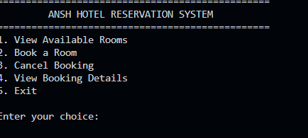
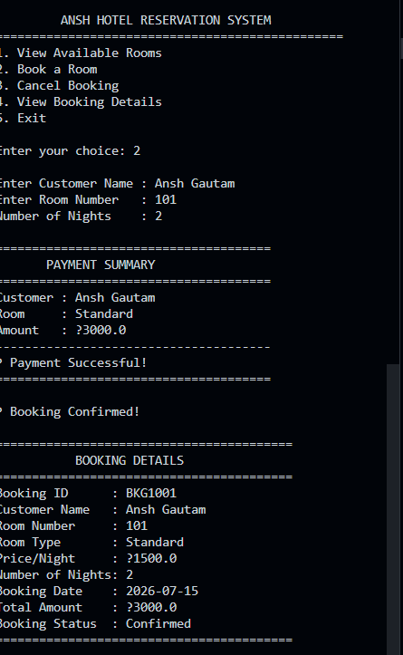
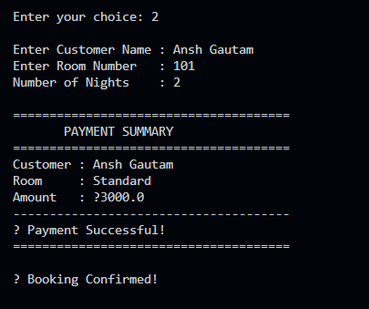
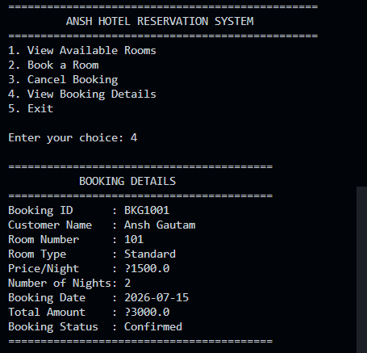

<div align="center">

# 🏨 Ansh Hotel Reservation System

### A Professional Hotel Booking & Management System built using **Core Java** & **Object-Oriented Programming**

<p align="center">
    
    
    
    
</p>

### 🏨 Book • Manage • Cancel • Track Reservations

---

# 📖 Overview

The **Ansh Hotel Reservation System** is a console-based hotel booking application developed using **Core Java** and **Object-Oriented Programming (OOP)**.

The application allows users to view available rooms, make reservations, cancel bookings, simulate payments, and manage booking records through an interactive console interface.

This project was developed as **Task 4** of the **Horizon TechX Java Programming Internship**.

---

# ✨ Features

* 🏨 View Available Rooms
* 🛏 Book Rooms
* ❌ Cancel Reservation
* 💳 Payment Simulation
* 📄 View Booking Details
* 💰 Automatic Bill Calculation
* 📋 Room Categories
* 📊 Booking Summary

---

# 🛠 Tech Stack

| Technology                 | Purpose                |
| -------------------------- | ---------------------- |
| ☕ Java                     | Core Programming       |
| 🧠 OOP                     | Object-Oriented Design |
| 📚 ArrayList               | Store Rooms & Bookings |
| ⌨ Scanner                  | User Input             |
| 💻 VS Code / IntelliJ IDEA | Development            |
| 🌱 Git & GitHub            | Version Control        |

---

# 📂 Project Structure

```text
AnshHotelReservationSystem
│
├── src
│   ├── Room.java
│   ├── Booking.java
│   ├── Hotel.java
│   └── Main.java
│
├── screenshots
│   ├── home.png
│   ├── booking.png
│   ├── payment.png
│   └── reservation-details.png
│
├── README.md
└── LICENSE
```

---

# ⚙️ Program Workflow

```text
           Start
             │
             ▼
       Main Menu
             │
 ┌───────────┼────────────┐
 ▼           ▼            ▼
View      Book Room   Cancel Booking
Rooms         │
              ▼
      Payment Simulation
              │
              ▼
      Booking Confirmation
              │
              ▼
      Booking Details
              │
              ▼
         Return Menu
```

---

# 🧠 OOP Concepts Used

| Concept       | Implementation         |
| ------------- | ---------------------- |
| Class         | Room, Booking, Hotel   |
| Object        | Room & Booking Objects |
| Constructor   | Initialize Rooms       |
| Encapsulation | Private Variables      |
| Collections   | ArrayList              |
| Methods       | Booking Operations     |

---

# 📊 Functionalities

| Feature            | Status |
| ------------------ | ------ |
| View Rooms         | ✅      |
| Book Room          | ✅      |
| Cancel Booking     | ✅      |
| Payment Simulation | ✅      |
| View Reservation   | ✅      |
| Exit               | ✅      |

---

# 🏨 Room Categories

| Room Type | Price/Night |
| --------- | ----------: |
| Standard  |       ₹1500 |
| Deluxe    |       ₹2500 |
| Suite     |       ₹5000 |

---

# 🖥 Sample Output

```text
=========================================
   ANSH HOTEL RESERVATION SYSTEM
=========================================

1. View Available Rooms
2. Book Room
3. Cancel Booking
4. View Booking Details
5. Exit

Enter Choice: 2

Customer Name : Ansh

Room Number : 201

Number of Nights : 3

Total Amount : ₹7500

Payment Successful!

Booking Confirmed!
```

---

# 📸 Screenshots

### 🏠 Home Screen

<p align="center">

</p>

---

### 🛏 Booking Room

<p align="center">

</p>

---

### 💳 Payment

<p align="center">

</p>

---

### 📄 Reservation Details

<p align="center">

</p>

---

# 🚀 Getting Started

### Clone Repository

```bash
git clone https://github.com/YOUR_USERNAME/AnshHotelReservationSystem.git
```

### Open Project

```bash
cd AnshHotelReservationSystem
```

### Compile

```bash
javac Main.java
```

### Run

```bash
java Main
```

---

# 💡 Future Enhancements

* 💾 File Handling
* 🗄 Database Integration (MySQL)
* 🔐 Admin Login
* 📧 Email Confirmation
* 🌐 Java Swing GUI
* 📱 Online Booking API
* ⭐ Customer Reviews

---

# 📚 Learning Outcomes

Through this project, I learned:

* Core Java Programming
* Object-Oriented Programming
* Collections Framework
* Console Application Development
* Business Logic Design
* Reservation Management
* Git & GitHub Workflow

---

# 👨‍💻 Developer

**Ansh Gautam**

📌 Project: **Ansh Hotel Reservation System**

---

<div align="center">

### ⭐ If you found this project helpful, don't forget to Star the repository!

Made with ❤️ using Java by **Ansh Gautam**

</div>
